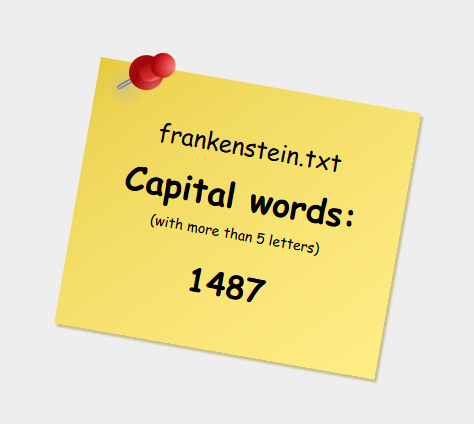

# About the Project

Assignment: Build a web server in .NET that counts words in a text file starting with an uppercase letter and containing more than five characters. The server should support concurrent processing using threads and include a caching mechanism to optimize repeated requests.

Main goal: Gain familiarity with thread usage and parallel execution in .NET Framework.

The implemented solution is a web server that handles each request in a separate thread using `ThreadPool`. Requests are handled via GET method, with the file name passed as a parameter. The server recursively searches directories starting from the root to locate the requested file and then performs the word count operation. I leveraged `ThreadPool` for concurrent processing of text, assigning each thread to count words in a separate paragraph. For caching, I implemented a straightforward `LRU cache`, ensuring that recently accessed file names and their word counts remain readily available

The server logs all incoming requests and outgoing responses directly to the console. Each log entry captures timestamps detailing the processing duration, and the outcome of each interaction, indicating whether the operation was successful.

Visual interface was created solely for testing. Homepage displays a list of *all* text files located in the root directory and its subdirectories. The root folder path can be modified in Program.cs file.

- The word count of a file can be requested either by clicking on its name from the homepage or by entering the file name in the URL, for example: `http://localhost:18859/example.txt`

    
    
After requesting the word count for an existing file, the response will display the word count stylized as a note pictured below:

    

