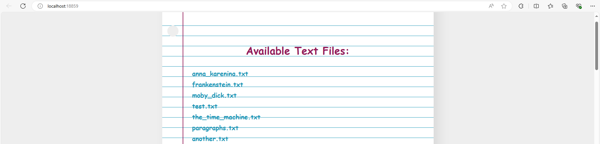

<a id="readme-top"></a>

[![MIT License][license-shield]][license-url]


<!-- PROJECT LOGO -->
<br />
<div align="center">
  <a href="https://github.com/sic-mundus-creatus-est/sysprog-project-one">
    
  </a>

<h3 align="center">sysprog-project-one</h3>

  <p align="center">
    The project's main goal was to familiarize with thread usage and parallel execution in .NET Framework as part of the System Programming course.
    <br />
    <br />
    <br />
    <strong>Check out my solutions of other System Programming course projects »</strong>
    <br />
    <a href="https://github.com/sic-mundus-creatus-est/sysprog-project-two">sysprog-project-two</a>
    ·
    <a href="https://github.com/sic-mundus-creatus-est/sysprog-project-three">sysprog-project-three</a>
  </p>
</div>


<!-- TABLE OF CONTENTS -->
<details>
  <summary>Table of Contents</summary>
  <ol>
    <li>
      <a href="#about-the-project">About the Project</a>
      <ul>
        <li><a href="#built-with">Built With</a></li>
      </ul>
    </li>
    <li>
      <a href="#getting-started">Getting Started</a>
      <ul>
        <li><a href="#prerequisites">Prerequisites</a></li>
        <li><a href="#installation-and-setup">Installation and Setup</a></li>
      </ul>
    </li>
    <li><a href="#usage">Usage</a></li>
    <li><a href="#license">License</a></li>
  </ol>
</details>


<!-- ABOUT THE PROJECT -->
## About the Project

This project was done as a university assignment, with the main goal to get familiar with thread usage and parallel execution in .NET Framework. The assignments were randomized and included a problem-solving task related to various file formats or APIs, with each solution requiring a web server and a cache implementation. (Un)luckily, I ended up with the most mundane task: counting words in a found file that start with an uppercase letter and have more than 5 characters. The implemented solution is a `HTTP web server` that handles each request in a separate thread using `ThreadPool`. Requests are handled via the GET method from a browser, passing the file name as a parameter. The server recursively searches directories starting from the root to locate the requested file and performs the word count operation. I also leveraged `ThreadPool` for concurrent processing of text, assigning each thread to count words in a unique paragraph. For caching, I opted for a straightforward implementation of an `LRU cache`. This choice ensures that recently accessed file names and their word count remain readily available in memory while making room for new data when the cache reaches its capacity limit.

Additionally, the server logs all incoming requests and outgoing responses directly to the console. Each log entry captures timestamps detailing the processing duration and response transmission time. It provides precise records of request reception, response dispatch, and the outcome of each interaction, indicating whether the operation was successful.

<div style="text-align: center;">
  
</div>

Although a frontend component was not required for the assignment, I added it for ease of testing. The homepage is an list that displays all text files from the root directory and its subdirectories. This feature was created solely to facilitate testing and is not intended to serve as a practical web page example. Viewing the homepage with thousands of files is <strong>not recommended</strong> due to its extensible list.

</br>

- You can request the word count of a file by either clicking on a file name from the homepage or by simply entering the URL as: `http://localhost:18859/example.txt`

<div align="center">
    
    <p align="center" style="margin: 0;">After requesting the word count for an existing file, the response will display the word count stylized as a note pictured below:</p>
    
</div>

</br>

<div align="center" style="color: #ff69b4;">
    <p><em>All incorrect responses will return an appropriate HTTP error code.</em></p>
</div>

<p align="right"><a href="#readme-top">(back to top)⬆️</a></p>

### Built With

* ![C#][CSharp] ![.NET][Dotnet]
* ![CSS][Css]
* ![HTML][Html]

<p align="right"><a href="#readme-top">(back to top)⬆️</a></p>


<!-- GETTING STARTED -->
## Getting Started

To get a local copy up and running follow these simple steps.

### Prerequisites

For the easiest setup, I recommend having Visual Studio installed and set up, with .NET 8.0 installed.

### Installation and Setup

1. Clone the repo
   ```sh
   git clone https://github.com/sic-mundus-creatus-est/sysprog-project-one.git
   ```
2. Open up the project solution file called `CapitalWordCounter.sln`
3. Navigate to Program.cs file
    - Option 1:
        - Create a folder called root in the following location: `sysprog-project-one\CapitalWordCounter\CapitalWordCounter\bin\Debug\net8.0` (or Release, depending on how you plan to run it)
    - Option 2:
        - Change the folder path from root to wherever you're going to be storing your test files
          ```csharp
          string rootFolder = @".\root"; // <== file searching always starts here, change it if needed
          ```
4. Place some .txt files in the chosen root folder (if you don't have any, I recommend Project Gutenberg, a digital library of books in many formats)
5. Check if the hard coded port `18859` is avaliable on your PC before running
   ```sh
   # To check if a port is avaliable on your PC:
             Windows: netstat -ano | findstr :18859
             Linux: netstat -tuln | grep 18859
   ```
   - If the port is already taken, change it here in the `Program.cs` file:
     ```csharp
     string serverURL = "http://localhost:[port]/"; // <== also a "homepage"
     ```
6. Finally, you're ready to start the server by pressing `Ctrl+F5` on your keyboard, or by clicking on the start button in the VS itself
    - _starting the server should open up the `homepage` on your default browser automatically_
7. To stop the server, simply press _any_ key

<br/>
<br/>

<div align="center" style="color: gray;">
  <i>you can also adjust the cache capacity in the CWC.Server.cs file within the constructor of CWC_Server</i>
</div>

<p align="right"><a href="#readme-top">(back to top)⬆️</a></p>


<!-- USAGE EXAMPLES -->
## Usage

While I can't think of many practical uses for this specific functionality, I guess it could be a fun way to analyze your favorite books and pull out interesting trivia!?!

The real value of this project, though, lies in the lessons learned about parallel execution. It gave me a solid understanding of what should be parallelized, how to effectively use threads, and why synchronization methods are crucial when dealing with multiple simultaneous requests that access the same locations.

During some stress/load testing with a simple Python script, I found that the solution can handle up to about 700 simultaneous requests on a fresh start with no items in cache, and up to about 1000 requests when there are items in cache (on my configuration). These tests allowed me to implement proper synchronization methods for storing items in the in-memory cache.

I recon that this implementation is not fully optimized and that there’s definitely room for improvement, but I’m leaving it as is to serve as a point of reference for my progress in coding. Additionally, it served as great practice for writing a README file, which is an essential skill for software documentation.

<p align="right"><a href="#readme-top">(back to top)⬆️</a></p>


<!-- LICENSE -->
## License

Distributed under the MIT License. See `LICENSE` for more information.

<p align="right"><a href="#readme-top">(back to top)⬆️</a></p>


<!-- MARKDOWN LINKS & IMAGES -->
[license-shield]: https://img.shields.io/github/license/sic-mundus-creatus-est/sysprog-project-one?style=for-the-badge
[license-url]: https://github.com/sic-mundus-creatus-est/sysprog-project-one/blob/main/LICENSE

[CSharp]: https://custom-icon-badges.demolab.com/badge/C%23-%23239120.svg?logo=cshrp&logoColor=white
[Dotnet]: https://img.shields.io/badge/.NET-512BD4?logo=dotnet&logoColor=fffS
[Css]: https://img.shields.io/badge/CSS-1572B6?logo=css3&logoColor=fff
[Html]: https://img.shields.io/badge/HTML-%23E34F26.svg?logo=html5&logoColor=white
